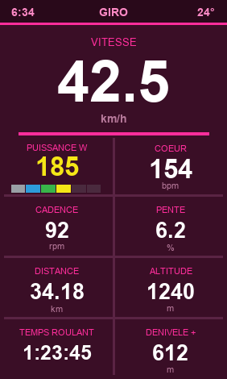

# Giro Pink — Champ de données plein écran (Garmin Edge 1040)

Un champ de données **unique qui occupe tout l'écran** du Garmin Edge 1040, dans
le style **maglia rosa** (le rose du Giro d'Italia). Conçu pour être à la fois
très lisible et beau sur le vélo.

## Ce qu'il affiche

La hiérarchie visuelle met en avant les valeurs les plus utiles en roulant :

| Zone | Donnée | Taille |
| --- | --- | --- |
| Bandeau haut | Heure · « GIRO » · Température (°C) | petite |
| **Bandeau rose** | **Vitesse (km/h)** | **très grande** |
| Ligne 1 | Puissance (W) · Fréquence cardiaque (bpm) | grande |
| Ligne 2 | Cadence (rpm) · Pente (%) | moyenne |
| Ligne 3 | Distance (km) · Altitude (m) | moyenne |
| Ligne 4 | Temps en roulant · Dénivelé + (m) | moyenne |

### Détails utiles

- **Vitesse** : convertie en km/h, mise en vedette dans le bandeau rose.
- **Temps en roulant** : basé sur le *timer* de l'activité (`timerTime`), il se met
  en pause à l'arrêt — contrairement au temps total écoulé.
  👉 Active **Auto Pause** sur l'Edge pour qu'il s'arrête vraiment dès que tu poses le pied.
- **Pente** : calculée à partir de la variation d'altitude sur la distance, avec un
  lissage pour éviter les sauts. S'affiche après ~10 m parcourus.
- **Température** : capteur interne de l'Edge (permission `Sensor`).
- **Style « Carbone Rosa »** : fond en **dégradé prune** (`#2C0A1C` → `#4E1033`),
  accents **rose néon** (`#FF2E9C`) pour les libellés et les lignes, valeurs en blanc
  pour une lisibilité maximale.
- **Puissance aux couleurs Zwift** : le chiffre de puissance prend la couleur de la
  zone Zwift et une **barre de 6 segments** s'allume jusqu'à ta zone :
  Z1 gris `<60%` · Z2 bleu `60-75%` · Z3 vert `76-89%` · Z4 jaune `90-104%` ·
  Z5 orange `105-118%` · Z6 rouge `≥119%` (en % de ton FTP).
- **Réglage FTP** : dans les paramètres de l'appli (Garmin Connect / Connect IQ),
  champ *FTP (W)*. `0` = utilise le FTP de ton profil Garmin, sinon 200 W par défaut.

## Compiler / installer

Les scripts sont dans `scripts/` (double-clic sous Windows) :

| Script | Rôle |
| --- | --- |
| `CREER-CLE.bat` | Crée la clé développeur Garmin (`config/developer_key.der`). |
| `COMPILER.bat` | Compile une version test (`bin/GiroPink.prg`). |
| `METTRE-SUR-IQ.bat` | Compile et copie le `.prg` sur l'Edge branché en USB. |
| `BUILD-IQ.bat` | Génère le `.iq` pour publication sur le Connect IQ Store. |

Le SDK utilisé : `D:\logiciel que cursor a instalée\Garmin-ConnectIQ`.

### Installation manuelle

1. Lance `COMPILER.bat` (génère `bin/GiroPink.prg`).
2. Branche l'Edge 1040 en USB.
3. Copie `GiroPink.prg` dans `GARMIN/APPS/` de l'appareil (ou utilise `METTRE-SUR-IQ.bat`).
4. Sur l'Edge : ajoute un écran de données, choisis **1 champ**, puis sélectionne
   **Connect IQ → Giro Pink**.

## Régénérer les images

- Icône : `py store-assets/generate_icon.py` → `resources/drawables/launcher_icon.png`
- Aperçu : `py store-assets/generate_preview.py` → `store-assets/apercu-edge1040.png`

## Notes

- Appareil cible : **Edge 1040** uniquement (`manifest.xml`).
- Unités : **métriques** (km/h, km, m, °C).
- La clé développeur (`config/`) ne doit **jamais** être partagée ni commitée.
